<div align="center">

  <!-- Typing animation -->
  <a href="https://github.com/ameynarwadkar" target="_blank">
    
  </a>

</div>

<div align="center">
  
</div>

<br/>

<div align="center">

  <a href="https://ameynarwadkar.github.io/" target="_blank">
    
  </a>
  &nbsp;
  <a href="https://www.linkedin.com/in/amey-narwadkar-474332231" target="_blank">
    
  </a>
  &nbsp;
  <a href="https://medium.com/@amey.cmyo" target="_blank">
    
  </a>
  &nbsp;
  

</div>

<br/>


<br/>

## About Me


```json
{
  "name": "Amey Narwadkar",
  "location": "Heidelberg, Germany",
  "education": {
    "masters": "Scientific Computing @ Universitat Heidelberg",
    "bachelors": "Mathematics @ Fergusson College, Pune"
  },
  "current_role": "Working Student @ NEC Laboratories Europe",
  "focus_areas": [
    "Multi-Agent Systems",
    "RAG & LLM Systems",
    "Applied AI Systems",
    "Efficient NLP"
  ],
  "status": "Open to AI/ML roles"
}
```

> *I build ML systems at the intersection of math, research, and engineering. I care about making models robust, efficient, and actually useful in production.*

<br clear="both"/>
<br/>


<br/>

## Tech Arsenal

<div align="center">

<table>
<tr>
<td align="center" width="96">
  
  <br/><sub><b>Python</b></sub>
</td>
<td align="center" width="96">
  
  <br/><sub><b>PyTorch</b></sub>
</td>
<td align="center" width="96">
  
  <br/><sub><b>FastAPI</b></sub>
</td>
<td align="center" width="96">
  
  <br/><sub><b>Docker</b></sub>
</td>
<td align="center" width="96">
  
  <br/><sub><b>Kubernetes</b></sub>
</td>
<td align="center" width="96">
  
  <br/><sub><b>GCP</b></sub>
</td>
<td align="center" width="96">
  
  <br/><sub><b>Linux</b></sub>
</td>
</tr>
<tr>
<td align="center" width="96">
  
  <br/><sub><b>PostgreSQL</b></sub>
</td>
<td align="center" width="96">
  
  <br/><sub><b>Redis</b></sub>
</td>
<td align="center" width="96">
  
  <br/><sub><b>React</b></sub>
</td>
<td align="center" width="96">
  
  <br/><sub><b>Next.js</b></sub>
</td>
<td align="center" width="96">
  
  <br/><sub><b>TypeScript</b></sub>
</td>
<td align="center" width="96">
  
  <br/><sub><b>Git</b></sub>
</td>
<td align="center" width="96">
  
  <br/><sub><b>Bash</b></sub>
</td>
</tr>
<tr>
<td align="center" width="96">
  
  <br/><sub><b>OpenCV</b></sub>
</td>
<td align="center" width="96">
  
  <br/><sub><b>sklearn</b></sub>
</td>
<td align="center" width="96">
  
  <br/><sub><b>R</b></sub>
</td>
<td align="center" width="96">
  
  <br/><sub><b>HTML</b></sub>
</td>
<td align="center" width="96">
  
  <br/><sub><b>CSS</b></sub>
</td>
<td align="center" width="96">
  
  <br/><sub><b>Supabase</b></sub>
</td>
<td align="center" width="96">
  
  <br/><sub><b>VS Code</b></sub>
</td>
</tr>
</table>

</div>


<br/>

## What I'm Working On

<table>
<tr>
<td width="50%">

### Multi-Agent Systems
Building autonomous agent teams that collaborate to solve complex tasks, from research synthesis to automated workflows.

</td>
<td width="50%">

### RAG & LLM Systems
Production-ready retrieval pipelines with hybrid search, reranking, structured outputs, and rigorous evaluation.

</td>
</tr>
<tr>
<td width="50%">

### Applied AI Systems
End-to-end ML applications: computer vision, conversational AI, sentiment analysis, and automation pipelines.

</td>
<td width="50%">

### Efficient NLP
Making language models faster and cheaper with early-exit inference, calibration, and compute-aware optimization.

</td>
</tr>
</table>

<br/>


<br/>

## Featured Projects

<table width="100%">
<tr>
<td width="50%" valign="top">

### [EU Financial Regulation Hybrid RAG](https://github.com/ameynarwadkar/finRAG)
Hybrid RAG over 382 parsed EU regulation articles. Features dual-index search with RRF fusion, ONNX-powered FlashRank reranking, and schema-constrained generation to ensure zero hallucinations.

`Python` · `FastAPI` · `Qdrant` · `ONNX`

</td>
<td width="50%" valign="top">

### [Multi-Agent Research Assistant](https://github.com/ameynarwadkar/adk-research-agent)
A 7-agent system orchestrated via Google ADK that searches ArXiv, PubMed, and OpenAlex. It clusters papers, rigorously assesses evidence quality, and synthesizes publication-ready literature reviews.

`Python` · `LangGraph` · `OpenAI` · `Docling`

</td>
</tr>
<tr>
<td width="50%" valign="top">

### [Early-Exit Inference for BERT](https://github.com/ameynarwadkar/Eff-NLP-Project)
Implemented early-exit strategies for BERT using entropy, margin, and patience-based halting. Integrated micro self-verification and conducted latency & calibration analysis.

`PyTorch` · `Hugging Face` · `BERT` · `NLP`

</td>
<td width="50%" valign="top">

### [Tennis Analysis System](https://github.com/ameynarwadkar/Tennis-Analysis-System)
End-to-end tennis video analysis pipeline featuring YOLO-based player detection, CNN ball tracking, court keypoint estimation, real-time speed metrics, and a dynamic mini-court visualization.

`PyTorch` · `OpenCV` · `YOLO` · `CNN`

</td>
</tr>
<tr>
<td width="50%" valign="top">

### [Character-Aware Encoder Under Typos](https://github.com/ameynarwadkar/CharLM-Project)
Evaluated sentence representations under synthetic typo noise using CANINE and SBERT. Benchmarked embedding stability using cosine similarity and Retrieval@1 metrics.

`PyTorch` · `Hugging Face` · `SBERT` · `CANINE`

</td>
<td width="50%" valign="top">

### [Sentiment Trading Bot](https://github.com/ameynarwadkar/sentiment-trading-bot)
Engineered a news sentiment-driven trading pipeline integrating FinBERT for signal generation, alongside comprehensive backtesting and automated execution logic.

`Python` · `FinBERT` · `pandas` · `Backtesting`

</td>
</tr>
<tr>
<td width="50%" valign="top">

### [Text-to-Image Generation](https://github.com/ameynarwadkar/Stable-Diff-Model)
Implemented a Stable Diffusion-based text-conditioned image generation model focusing on prompt adherence and visual fidelity.

`PyTorch` · `Stable Diffusion` · `CUDA`

</td>
<td width="50%" valign="top">

### [ML Algorithms from Scratch](https://github.com/ameynarwadkar/ML-algorithms-from-scratch)
Implemented core machine learning algorithms (Linear/Logistic Regression, Decision Trees) entirely from mathematical first principles using Python and NumPy.

`Python` · `NumPy` · `Mathematics`

</td>
</tr>
</table>


<br/>

## Contributions

<div align="center">
  <picture>
    <source media="(prefers-color-scheme: dark)" srcset="https://raw.githubusercontent.com/ameynarwadkar/ameynarwadkar/output/github-contribution-grid-snake-dark.svg" />
    <source media="(prefers-color-scheme: light)" srcset="https://raw.githubusercontent.com/ameynarwadkar/ameynarwadkar/output/github-contribution-grid-snake.svg" />
    
  </picture>
</div>


